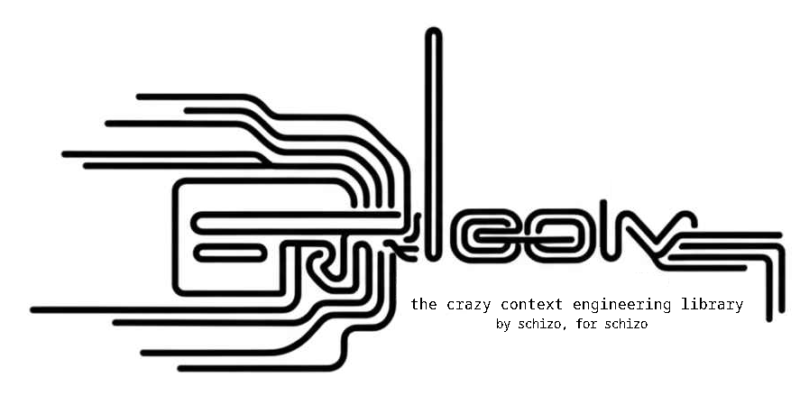

<!-- # Errloom: Reinforcement Learning with LLMs in Verifiable Environments -->

## 1. Overview




> Errloom /ˈɜːrluːm/ – _From the combination of "err" (to wander) and "loom" (classic concept of shoggoth whispering). It reflects the core philosophy of the framework: allowing language models to wander through a space of possibilities, guided by the gravitation of attractors, rewards, and penalties—learning from and being shaped by error.

**Errloom** is the schizo prompt theorist's swiss army knife for context engineering and reinforcement learning brought together as one in the unified Holoware language (.hol) of prompt engineering. It is a framework for training LLMs with reinforcement learning with verifiable reward (attractors & gravitation rules). It provides a powerful suite of tools and abstractions for orchestrating large language models, with a focus on deconstructing complex, recursive, and agentic workflows into simple, composable, and reusable atoms strug together in .hol recipes. It can be used as a library or standlone CLI, and supports deploying to cloud compute. It aims to demoncratize reinforcement learning experimentation and usher a new era of prompt engineering.


##  2. Usage

### Standalone

Install errloom to your system using pip:

```
```

It is recommended to break the system packages to avoid taking on the unnecessary stress and confusion of others.

We then write a .hol holoware:

```
```

Finally we launch the training using vast.ai for compute:

```
```

We **greatly** encourage the community to self-organize and implement as many compute providers under an abstraction in this interface to multiply the power of Errloom.


## 3. Roadmap

### Atropos

Write an holoware environment for Nous Research Atropos reinforcement learning library. (optional dependency on Atropos)
This will allow the experiments conducted by Errloom users to scale using their more sophisticated pipeline for
distributed training across the globe. We envision a market of environments and holowares where users submit proposals
that are taken by compute volunteers.

## 4. Wiki

For more information, please visit the wiki pages.

1. Definitions
2. Holoware DSL (.hol)

## 5. Citation

This project builds upon the original `verifiers` library created by Will Brown.

If you use this code in your research, please update and use the following citation:

```bibtex
@article{brown2025errloom,
  title={Errloom: Schizo Reinforcers},
  author={Nicolas Martel},
  year={2025}
}
```

<!-- At its core is **Holoware**, a first-class Domain-Specific Language (DSL) for **Context Engineering**. Holoware allows you to define not just prompts, but entire interaction protocols, training regimes, and reward mechanisms in a single, human-readable format. This approach democratizes RL by enabling the rapid prototyping and scaling of novel training and inference schemes, from tool use and self-reward to complex agentic loops.

**Core principles**:
- **Deconstruction over Abstraction**: Break down complex agentic loops and RL schemes into their constituent parts using the Holoware DSL.
- **Emergence through Composition**: Create complex behaviors by composing simple, understandable atoms (`Holotypes`) within a Holoware template.
- **Verifiability**: Environments and rewards should be transparent, hackable, and easy to define.

**Key features:**
- **GRPO Trainer**: An efficient implementation of Group-Relative Policy Optimization built on `transformers.Trainer`, optimized for async multi-turn inference and training.
- **Holoware DSL (`.hol`):** A powerful templating language for defining multi-turn conversations, training data, and agentic logic in one place.
- **Holotypes:** Custom Python classes (`__holo__`) that can be seamlessly injected into Holoware templates to perform arbitrary logic, from data augmentation to dynamic reward calculation and tool execution.
- **First-class Tool Use:** Natively define and manage complex tool-use loops directly within your `.hol` files.
- **Extensible & Hackable:** The entire framework is designed to be modular and easy to modify, from the parser to the core execution loop.

## The Holoware Ecosystem

Holoware is the heart of `errloom`. It's a complete ecosystem for defining and executing complex interactions with LLMs.

- **Holoware (`.hol` files):** These are the blueprints for your interactions. They define the conversation flow, data injection points, and where to bring in custom logic.
- **Holotypes:** These are special Python classes that implement a `__holo__` method. When a Holotype is referenced in a `.hol` file (e.g., `<|MyToolRunner|>`), it's instantiated and its `__holo__` method is called, allowing for dynamic, stateful management of the interaction.
- **Holophore:** The final, rendered output of a Holoware template—a structured object ready to be sent to an LLM.
- **Loom:** The engine that weaves together Holoware, Holotypes, and data to produce a Holophore.

## Example: Defining a Tool-Using Agent with `tool.hol`

The best way to understand Holoware is to see it in action. Here is the content of `errloom/hol/tool.hol`, a template designed to create a tool-using agent.

```holoware
# prompts/tool.hol

<|+++|>
# System prompt section.
<|o_o|>
You have access to the following tools to help solve problems:

<|ToolSchema|>

For each step:
1. Think through your reasoning inside <reasoning> tags
2. If needed, use a tool by writing a JSON command inside <tool> tags with:
   - "name": the tool to use
   - "args": the arguments for the tool
3. You will see the tool's output inside <result> tags
4. Continue until you can give the final answer inside <answer> tags

Tools expect specific JSON input formats. Follow the examples carefully.
Do not make up tools or arguments that aren't listed.

<|few_shot|>

# This is the initial user query.
<|@_@|>
<|query|>

# --- Main Interaction Loop ---
# A `ToolRunner` class would manage this looping behavior up to a max_turns limit.
<|ToolRunner|>
    # The model generates its reasoning and a tool call or a final answer.
    <|@_@:turn <>think|>

    # The `ToolExecutor` class's `__holo__` method would:
    # 1. Parse the 'turn' output for a <tool> tag.
    # 2. If found, call the tool function with the provided JSON args.
    # 3. Format the result inside <result> tags.
    # 4. If <answer> is found, terminate the loop.
    # 5. Return the result as a user message for the next turn.
    <|o_o|>
    <|ToolExecutor turn|>
```

### Deconstructing the Example

This single file defines a complete, multi-turn, tool-using environment, which can be used for data generation, evaluation, or RL training.

1.  **Setup (`<|+++|>`):** The file begins by defining the environment.
    -   It sets a system prompt (`<|o_o|>`) that instructs the model on how to behave.
    -   `<|ToolSchema|>` and `<|few_shot|>` are **Holotypes**. `ToolSchema` would inject the schemas of the available tools, and `few_shot` would inject examples of correct tool usage.
    -   `<|query|>` is a data placeholder for the user's request.

2.  **Interaction Loop (`<|ToolRunner|>`):** This section defines the agentic loop.
    -   `<|ToolRunner|>` is a stateful **Holotype** that manages the multi-turn interaction.
    -   `<|@_@:turn <>think|>` prompts the assistant to generate a response, which is stored in the `turn` variable.
    -   `<|ToolExecutor turn|>` is the core of the tool execution logic. This **Holotype** receives the model's `turn` output. Its `__holo__` method is responsible for parsing the output, calling the appropriate tool if a `<tool>` tag is present, formatting the tool's output as a new user message (`<|o_o|>`), and determining if the loop should continue or terminate.

This example illustrates how a complex agentic loop is expressed declaratively. The logic for presenting tools (`ToolSchema`), managing the conversation turns (`ToolRunner`), and executing tools (`ToolExecutor`) is neatly encapsulated in reusable Python `Holotype` classes. This entire structure can then be passed to the `GRPOTrainer` to teach a model how to use tools effectively.

## Getting Started

### Setup 

To use the latest `main` branch, do:
```bash
git clone git@github.com:holo-q/errloom.git
cd errloom
uv sync --extra all && uv pip install flash-attn --no-build-isolation
```

**Troubleshooting:**
- Ensure your `wandb` and `huggingface-cli` logins are set up (or set `report_to=None` in `training_args`). You should also have something set as your `OPENAI_API_KEY` in your environment (can be a dummy key for vLLM). 
- On some setups, inter-GPU communication can hang. Try setting `NCCL_P2P_DISABLE=1` in your environment.

### Levels of Exploration
 
**Level 0:** Inspect and run the included examples.
- `errloom/examples/`: Find scripts that use different environments.
- `errloom/hol/`: Explore the different Holoware templates.

**Level 1:** Create your own Holoware file.
- Define a simple multi-turn conversation for your task.
- Use data placeholders like `<|my_data|>`.

**Level 2:** Write your first Holotype.
- Create a Python class with a `__holo__(self, holophore, span)` method.
- Register it so the Loom can find it.
- Reference it in your `.hol` file: `<|MyHolotype|>`.

**Level 3:** Implement a custom agentic loop.
- Create a `Holotype` that manages state across multiple turns.
- Use model output from one turn as an input to your `Holotype` in the next turn (`<|MyHolotype previous_output|>`).
- Use this structure to define a full RL environment.

**Level 4+:** Go wild.
- Implement multi-agent debates, self-improving systems, and novel reward mechanisms. -->
